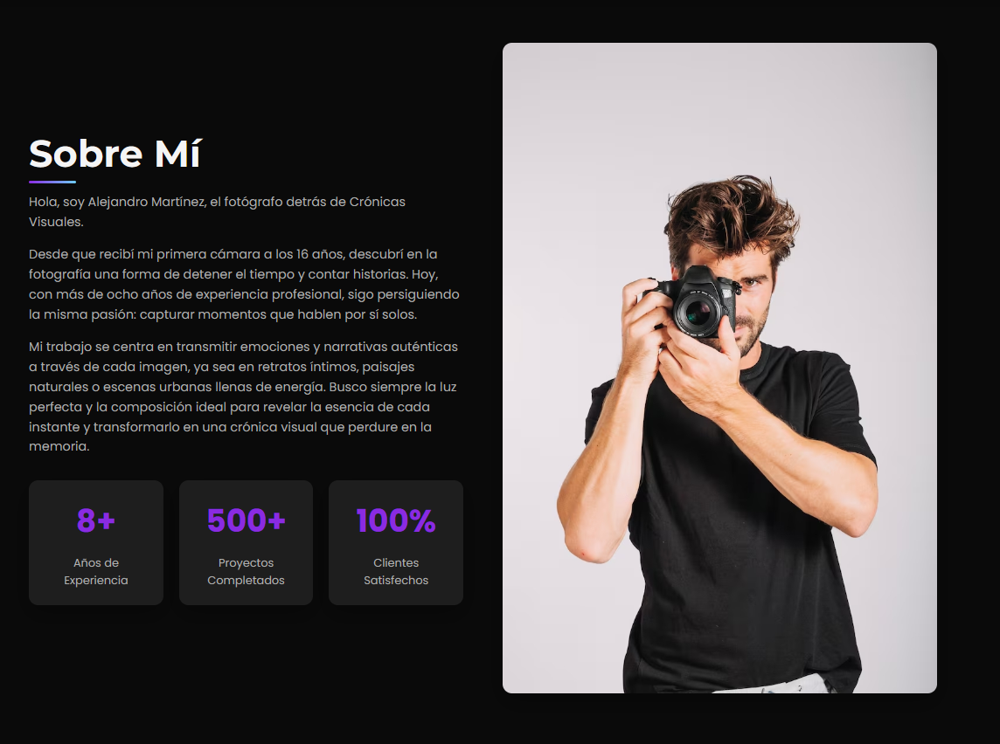

# 📸 Crónicas Visuales

**Crónicas Visuales** es una landing page moderna y cinematográfica desarrollada con **HTML, CSS y JavaScript puro**, creada para presentar el trabajo de un **fotógrafo profesional**.  
Su diseño está pensado para cautivar desde la primera vista, con una navegación fluida, animaciones sutiles y una experiencia inmersiva que refleja el arte de contar historias a través de la fotografía.

## 🌐 Demo

## 🖼️ Captura de Pantalla

## 💡 Características Principales
* 🎬 **Diseño cinematográfico y minimalista** con tipografías profesionales (*Poppins*, *Montserrat*).  
* 🕹️ **Interfaz interactiva** con animaciones, transiciones suaves y menú responsive.  
* 💬 **Sistema de testimonios dinámico** con deslizamiento automático.  
* 🌗 **Modo claro/oscuro** activable con un solo clic.  
* 🧭 **Navegación accesible y semántica**, optimizada para SEO.  
* 🖼️ **Galería filtrable** por categorías (Retrato, Naturaleza, Urbano, Producto).  
* 💰 **Sección de servicios** con precios, características y botón de reserva.  
* 📱 Totalmente **responsiva y adaptada a dispositivos móviles**.  
* 💬 **Formulario de contacto funcional** con validación.  
* 💬 **Botón flotante de WhatsApp** con tooltip promocional.

## 📂 Estructura del Proyecto
### CronicasVisuales/
### │── assets/
### │ ├── img/
### │    ├── fondo.jpg
### │    ├── foto.jpg
### │    └── logo.png
### │ ├── naturaleza/
### │    ├── bosque.jpg
### │    ├── mar.avif
### │    └── sendero.avif
### │ ├── producto/
### │    ├── computadora.jpeg
### │    ├── iphone.avif
### │    └── papas.jpg
### │ ├── retrato/
### │    ├── chica-1.avif
### │    ├── chica-2.avif
### │    └── chico-3.avif
### │ └── urbano/
### │    ├── ciudad-noche.avif
### │    ├── gente.jpg
### │    └── puente.avif
### │── css/
### │ └── styles.css
### │── js/
### │ └── script.js
### │── index.html
### │── preview.PNG
### └── README.MD

## 🛠️ Tecnologías Utilizadas
* **HTML5** → Estructura del sitio y accesibilidad semántica.  
* **CSS3** → Estilos modernos, flexbox, grid, efectos hover y animaciones.  
* **JavaScript (ES6)** → Funcionalidades dinámicas: preloader, galería filtrable, testimonios y modo oscuro.  
* **Font Awesome** → Íconos sociales e ilustrativos.  
* **Google Fonts** → Tipografía profesional (Poppins y Montserrat).

## 🧭 Secciones
1. **Inicio (Hero Section)** → Nombre, tipografía animada y botones de acción.  
2. **Sobre Mí** → Presentación del fotógrafo, experiencia y estadísticas.  
3. **Portfolio** → Galería filtrable con categorías dinámicas.  
4. **Servicios** → Cards con precios, características y botón de reserva.  
5. **Testimonios** → Opiniones de clientes en slider animado.  
6. **Contacto** → Información, formulario y enlaces a redes sociales.  
7. **Footer** → Información final del sitio y derechos reservados.

## ⚡ Optimización y Accesibilidad
* ✅ Etiquetas `aria-*` para navegación accesible.  
* ✅ Metaetiquetas Open Graph para compartir en redes.  
* ✅ Diseño adaptable, rápido y optimizado para SEO.  

## Redes sociales: 
[LinkedIn](https://www.linkedin.com/in/thomas-alan-ramirez/) | [Fiverr](https://es.fiverr.com/aramirezthomas?public_mode=true) | [Facebook](https://www.facebook.com/profile.php?id=61575025664166) | [Reddit](https://www.reddit.com/user/Late-Put-9295/)

## 🤝 Disponible para contratación
¿Querés una página igual de profesional para tu estudio o servicio?  
Podés obtener una **landing page como esta en mi perfil de Fiverr por solo $5 USD**.  
👉 [Visitar mi Fiverr](https://es.fiverr.com/s/1qv4kdp)

## 📄 Licencia
Este proyecto está bajo la **MIT License**.  
Libre para usar, modificar y distribuir.

## ⭐ ¿Te gustó este proyecto?
Apoyá con una ⭐ en GitHub y compartí esta landing page.  
**Crónicas Visuales** demuestra cómo un diseño elegante puede transformar la presentación de un artista visual.

# ✨ Gracias por visitar **Crónicas Visuales** — donde cada imagen cuenta una historia.

